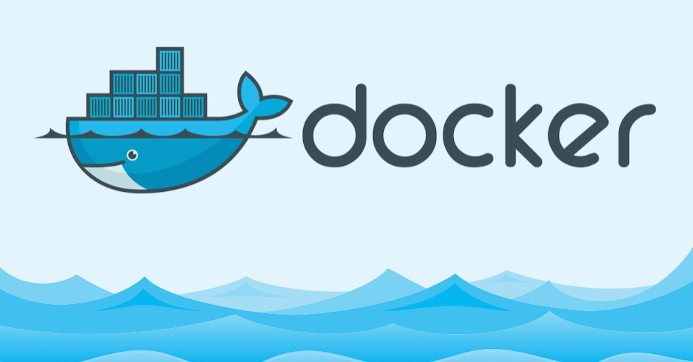
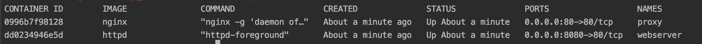
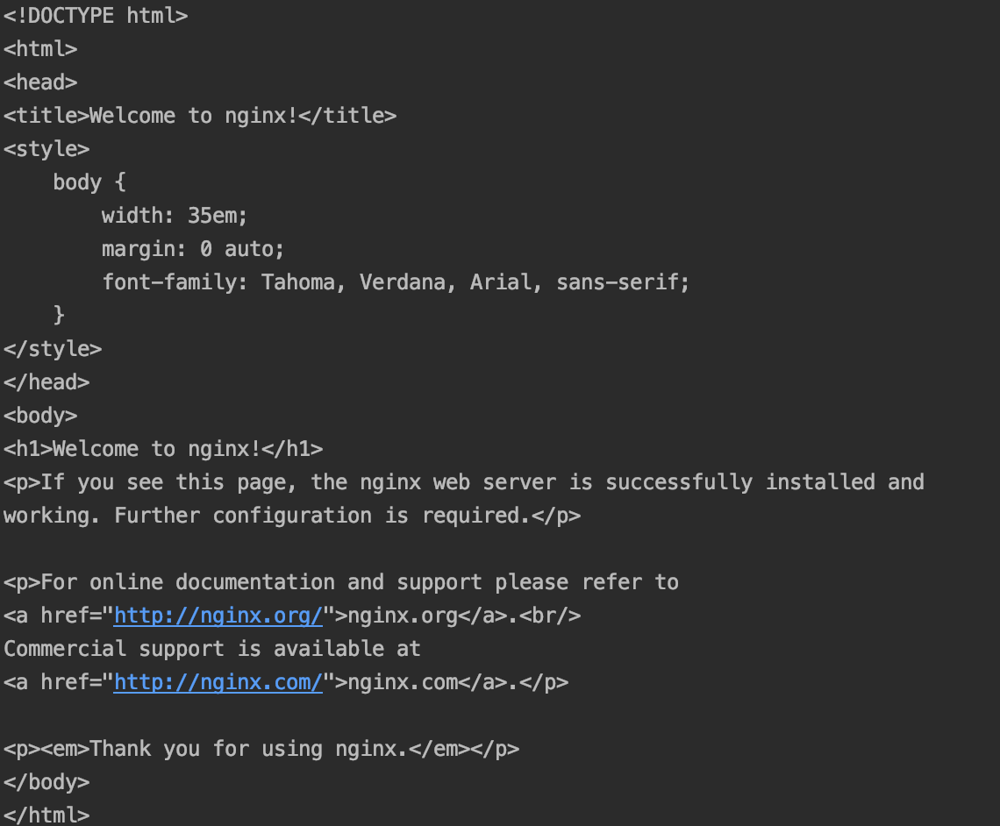
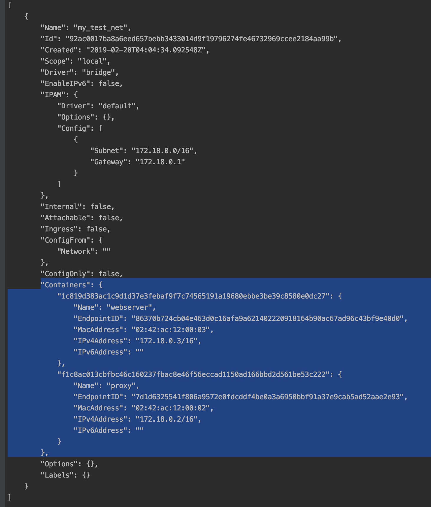
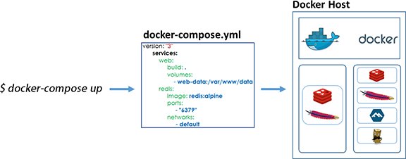

# Docker-lab

This lab is part of the foundations trainings at OCTO Technology Australia. It is an introduction for getting started with **Docker** !

<p align="center">
  
</p>

Here is the table of content of this Lab:\
\
    **1. Overview of Docker**\
    **2. Docker Run, Docker Hub and networks**\
    **3. Dockerfile, how to build our own container**\
    **4. Docker compose to manage all our containers !** \
    **X. Useful resources to go deeper**
 
It will take approximately 1 hour 30 (of fun) to complete !
 
# 1. Overview of what Docker is...

Docker is a tool designed to make it easier to create, deploy, and run applications by using containers. \
Containers allow a developer to package up an application with all of the parts it needs, such as libraries and other dependencies, and ship it all out as one package. \
By doing so, thanks to the container, the developer can rest assured that the application will run on any other Linux machine regardless of any customized settings that machine might have that could differ from the machine used for writing and testing the code.

### Prerequisite

Need to install docker.

### Docker main concepts

Here are the main concepts we'll try to cover briefly in this introduction lab ! 

**Image** -- **Container** -- **Dockerfile** -- **Volume** -- **Registry** -- **Compose**

Maximum suspens, right ? Let the fun begin... !


### Docker cli

First, Docker comes with a Command Line Interface to help you manage your containers. See [this cheatsheet](https://www.docker.com/sites/default/files/Docker_CheatSheet_08.09.2016_0.pdf) for more details on major commands ;) 

When creating a containerized application, you have 2 options:
* Pull existing images from [Docker hub](https://hub.docker.com/)
* Build your own containers with a custom Dockerfiles

We will have a look at these 2 options below.

### Image vs container

Image ? Container ? Ok I hear you, that's maybe two new notions... So here's some explanations :

A container is a standard unit of software that packages up code and all its dependencies so the application runs quickly and reliably from one computing environment to another.

A Docker image is a file used to execute code in a Docker container. The image is essentially built from the instructions for a complete and executable version of an application, which relies on the host OS kernel.
When the Docker user runs an image, it becomes an instance of that container.

Still not clear ? I get it, for more information, see [here](https://stackoverflow.com/questions/23735149/what-is-the-difference-between-a-docker-image-and-a-container)

Here is a little picture to show how all these notions map with each other. Hope this help !

<p align="center">
  
</p>


# 2. Time to run our first containers !

As stated above, Docker provides a nice Command Line Interface to manage your containers... 

For this quick start lab, we'll simply launch an "nginx" proxy and a "httpd" webserver thanks to Docker Hub registry !\
In a nutshell, **Docker Hub Registry** provides official and custom images that you can directly use without needing to build your whole container.

If you want to know more about Docker registry, you'll find some answers [here](https://docs.docker.com/docker-hub/). 

### Docker run

Start by running your first containers with **"docker run"** command.

```bash
docker run -d --name webserver -p 8080:80 httpd

docker run -d --name proxy -p 80:80 nginx
```

Ok, what are all these arguments ? Well...

* **-d** stand for "daemon". Otherwise the logs will prompt and you won't be able to access your current terminal.

* **--name** provides a custom name to your container

* **-p** is used to map the port from your container to the "outside world" ! \
Outside what ? Well, I won't go in much details but assume that your container is in its own private network for now. \
That means, if you want to access it, you need to provide ports to "redirect" the connexion :)

Take a look [here](https://docs.docker.com/config/containers/container-networking/) for more information on ports and netwworking but don't worry we'll cover that in more details below !


Let's see if we can see our containers... 
```bash
docker container ls -a
        OR
docker container ps
```

Yeah ! You should see the two containers you've created listed like below.

<p align="center">
  
</p>

ps : **-a** allow you to see all containers, event the stopped ones but we'll see that later.

As you can see, we've run a container in daemon... Now, suppose you want to access his logs, important command :

```bash
docker container logs <your_container_name>
```

All the logs are supposed to print in your terminal. Easy ! Here you won't see anything but just keep that in mind to debug for your future missions.

Now try to curl to your localhost ...

```bash
curl localhost 
```

You should see a nice message from nginx :

<p align="center">
  
</p>

All is up and running, quite fast to right ?


### Docker network

Now... How do we make containers communicate ? Let's talk more about **Networks**.

Just type 

```bash
docker network ls
```

You'll see the current list of existing networks. Bridge? host ? etc ... ? What are they ? \
You'll find good informations about that [here](https://blog.docker.com/2016/12/understanding-docker-networking-drivers-use-cases/).

If you want to create a new one, easy again, just use :
```bash
docker network create <your_network_name>
```

How to connect our containers to our new network now ? Easy ! Just use --network parameter as follow...

````bash
docker run -d --network <your_network_name> --name my_other_proxy -p 80:80 nginx
````

Now, type :

```bash
docker network inspect <your_network_name>
```

BOUM, a JSON file will prompt in your console ! 
You can see some basic information and specially the list of all containers inside this network, cool !

<p align="center">
  
</p>

That's it for this part, don't forget to stop and remove your containers ! \
Several ways to do it ...

```bash
docker container stop <container_name_1> <container_name_2> ...
 
docker container rm <container_name_1> <container_name_2> ... 
```

Or simply :

```bash
docker container rm -f <container_name_1> <container_name_2> ... 
```


Any questions ? \
To list all the available docker commands, just type :
```bash
docker --help
```

If you have a question about a command, you can quickly access information with 
```bash
docker <command> --help
```

You still have a long path to go but that was fun...
In the next part we'll see how to create our own container. Dockerfile, "docker build" is coming !

Go take a cup of coffee or a healthy juice, you've earned it and join me in the next part ;)


# 3. docker build, dockerfile

You now know how to quickly run a container by using Docker Hub and all the pre-built image that are available. Cool ! \
Now, we are going to talk about a new notion : the **Dockerfile** ! \
It allows you to create your own custom container. You can find [here](https://docs.docker.com/engine/reference/builder/) all you need to know about it. It's quite big right ?\
Don't worry, you don't need to know all this stuff for now. We'll take a look at the most important elements below !

The Dockerfile allows you to create the list of instructions necessary to create your container.

<p align="center">
  
</p>


Take a look at the Dockerfile it the current directory. \
Here's a list of the most important KEYWORDS :
* **FROM** : used to install the minimal Linux distribution on the container. 
* **RUN** : used to list the commands to execute on your container.
* **ADD** : used to add custom files (ex: config files) inside your container.
* **VOLUME** : used to create a volume inside the container to store data.
* **EXPOSE** : used to list the port exposed to the "outside world".
* **CMD** : command to execute when the container is launched.

Now, it's your turn to work a little bit.... Have a deeper look at all those 6 Keywords in the documentation [here](https://docs.docker.com/engine/reference/builder/).

### Docker build

Well, quite a lot of things to grasp. But so simple to create a container ! Do you feel the power of Docker now ? \
Now that you're a Dockerfile master, let's build our image ! How do we do ? \
Easy again... But be sure to have only your Dockerfile in your current directory ! Or the "Build operation" will go down recursively in all your files to build your image.

```bash
docker image build -t="my_first_image" .
```

You should see step by step Logs in your terminal. All is complete ? Great, run your first custom container now, so much emotion...

```bash
docker run -d --name my_first_container -p 80:80  my_first_image
```

Tadaaa! It's up and running... Feel free to inspect your container with :

```bash
docker container inspect my_first_container
```


Ok, quite a lot to learn with the Dockerfile and all the Keywords. Be sure to understand the main notions, have a look at the doc if you have still questions about it.\
Let's have a break because in our next topic, we'll learn how to manage and run all our containers in one file.\
Spoiler alert : **Docker compose** is coming ...

ps : don't forget to remove your container !

# 4. Docker compose, how to manage multiple container in one file...

### Volumes

Before talking about docker compose, let's learn how we link data to our containers !\
But before that, it is important to know that there is not different concepts : **Bind mounts & volumes**\
Find some information on the doc [here](https://docs.docker.com/storage/) or on stackoverflow [here](https://stackoverflow.com/questions/34357252/docker-data-volume-vs-mounted-host-directory).

How do we do it now ? With the **-v** parameter. Just like this :
```bash
docker run -d --name proxy -p 80:80 -v nginx.conf:/etc/nginx/conf.d/default.conf nginx 
```

Help : -v path_of_file_to_map:/path_of_file_inside_container

Now, you know how to provides custom configurations files inside your containers ! The same applies for any type of data :)
Great, now the final topic we will cover... Let's go for compose !

### Docker compose

A usual application is composed of multiple containers with links between them, maybe several volumes as well. We need a way to manage all of this. \
That's where Docker-Compose comes into play !\
It provides a simple way of defining your containerized application in a single yaml file. \
In other words, it simply allows you ta avoid launching multiple "docker run" commands from your terminal and synthesize all these in one file. Cool.

<p align="center">
  
</p>

An example of compose yaml file is provided in the repository and another one with some comments about each section.\
Before continue, please have a look at docker compose documentation [overview](https://docs.docker.com/compose/overview/).

More clear now ? Great. to start your app, be sure to be in the directory with your yaml file and just run :
```bash
docker-compose up
```

Yeah, that's it ! You noticed that we previously used 2 docker run commands with multiple parameters... \
Now, with just docker-compose up, it's all done. Easy, right ?

We won't go more in details of compose in this lab as it is only an introduction and you already learned quite a lot today...\
If you're curious, I encourage you to start with the [getting started](https://docs.docker.com/compose/gettingstarted/) from Docker documentation.

That's it... You've completed the lab. Well done again, hope you enjoyed it ! If you want to improve this lab, if you find bugs or somethings are not clear, raise a pull request !

<p align="center">
  
</p>

# X. Resources

Still have a lot of questions ? **Good For You** ! Really happy that you liked Docker as you will probably use it a lot very soon...\
Here are some great resources to grasp knowledge if you want. Enjoy !

Docker Mooc (Awesome ! Truly recommend it until Part 6 for a deep overview...)
> Docker Mastery: The Complete Toolset From a Docker Captain (https://www.udemy.com/docker-mastery/)

Docker documentation
> https://docs.docker.com/

Docker cheat sheet
> https://www.docker.com/sites/default/files/Docker_CheatSheet_08.09.2016_0.pdf
