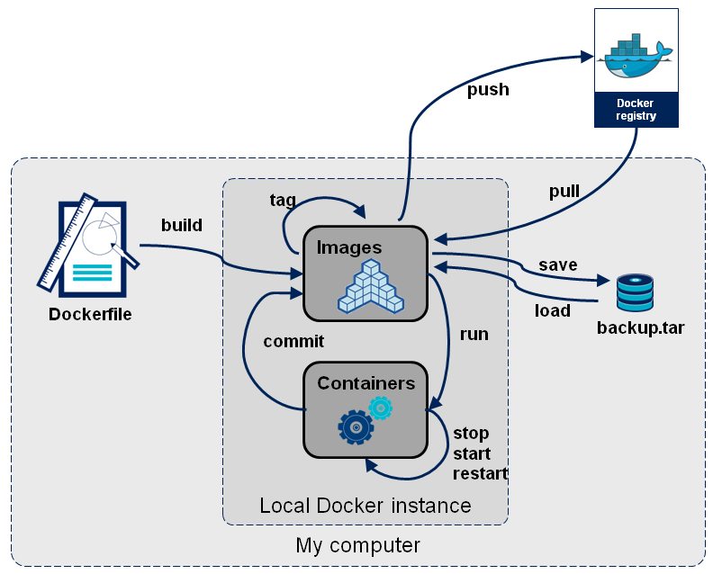

# docker-lab

This lab is part of the foundations trainings at OCTO Technology Australia. It is an introduction for getting started with docker !

# 1. Overview of what is Docker

Docker is a tool designed to make it easier to create, deploy, and run applications by using containers.
Containers allow a developer to package up an application with all of the parts it needs, such as libraries and other dependencies, and ship it all out as one package. 
By doing so, thanks to the container, the developer can rest assured that the application will run on any other Linux machine regardless of any customized settings that machine might have that could differ from the machine used for writing and testing the code.

### Prerequisite

Need to install docker.

### Docker main concepts :

Here are the main concepts we'll try to cover briefly in this introduction to Docker ! 

> Image 

> Container 

> Dockerfile 

> Volume 

> Registry

### Docker cli

First, Docker comes with a Command Line Interface to help you manage your containers. See [this](https://www.docker.com/sites/default/files/Docker_CheatSheet_08.09.2016_0.pdf) CheatSheet for more details on major commands ;) 

When creating a containerized application, you have 2 options:
* Pull existing images from [Docker hub](https://hub.docker.com/)
* Build your own containers with a custom Dockerfile

We will have a look at these 2 options below.

### Image vs container

Image ? Container ? Ok I hear you, that's maybe two new notions... So here's some explanations :

A container is a standard unit of software that packages up code and all its dependencies so the application runs quickly and reliably from one computing environment to another.

A Docker image is a file used to execute code in a Docker container. The image is essentially built from the instructions for a complete and executable version of an application, which relies on the host OS kernel.
When the Docker user runs an image, it becomes an instance of that container.

Still not clear ? I get it, for more information, see [here](https://stackoverflow.com/questions/23735149/what-is-the-difference-between-a-docker-image-and-a-container)

Here is a little picture showing how all these notions map to each other. Hope this help !




# 2. Time to run our first containers !

As stated above, Docker provides a nice Command Line Interface to manage your containers... 

For this quick start lab, we'll simply launch an "nginx" proxy and a "httpd" webserver thanks to Docker Hub registry !
In a nutshell, **Docker Hub Registry** provides official and custom images that you can directly use without needing to build your whole container.

If you want to know more about Docker registry, you'll find some answers [here](https://docs.docker.com/docker-hub/). 

### Docker run

Start by running your first containers with **"docker run"** command.

```bash
docker run -d --name webserver -p 8080:80 httpd

docker run -d --name proxy -p 80:80 nginx
```

Ok, what are all these arguments ? Well...

* **-d** stand for "daemon". Otherwise the logs will prompt and you won't be able to access your current terminal.

* **--name** provides a custom name to your container

* **-p** is used to map the port from your container to the "outside world" ! Outside what ? Well, I won't go in much details but assume that your container is in its own private network for now.
That means, if you want to access it, you need to provide ports to "redirect" the connexion :)

Take a look [here](https://docs.docker.com/config/containers/container-networking/) for more information !


Let's see if we can see our containers... 
```bash
docker container ls -a
        OR
docker container ps
```

Yeah ! You should see the two containers you've created listed like below.


ps : **-a** allow you to see all containers, event the stopped ones but we'll see that later.

Now try to curl to your localhost ...

```bash
curl localhost 
```

You should see a nice message from nginx :


All is up and running, so easy and fast right ?


### Docker network

Now... How do we make them communicate ? Let's talk about **Networks**.

Just type 

```bash
docker network ls
```

You'll see the current list of existing networks. Bridge? host ? etc ... ? What are they ?

You'll find good informations about that [here](https://blog.docker.com/2016/12/understanding-docker-networking-drivers-use-cases/)

If you want to create a new one, easy again, just use
```bash
docker network create <your_network_name>
```

How to connect our containers to our new network now ? Easy ! Just use --network parameter as follow...

````bash
docker run -d --network <your_network_name> --name my_other_proxy -p 80:80 nginx
````

Now, type 

```bash
docker network inspect <your_network_name>
```

BOUM, a JSON file will prompt in your console ! 
You can see some basic information and specially the list of all containers inside this network, cool !


That's it for this part, don't forget to stop and remove your containers ! 
Several ways to do it ...

```bash
docker container stop <container_name_1> <container_name_2> ...
 
docker container rm <container_name_1> <container_name_2> ... 
```

Or simply 

```bash
docker container rm -f <container_name_1> <container_name_2> ... 
```


Any questions ? 

To list all the docker CLI command, just type :
```bash
docker --help
```

If you have a question about a command, you can quickly access information with 
```bash
docker <command> --help
```

You still have a long path to go but that was fun...
In the next part we'll see how to create our own container. Dockerfile, "docker build" is coming !

Go take a cup of coffee or a juice, and join me in the next part ;)


# 3. docker build, dockerfile

**Dockerfile**

### Docker build


# 4. Docker compose, how to manage multiple container in one file...

**Volumes**

### Docker compose


# X. Ressources

Docker documentation
> https://docs.docker.com/

Docker cheat sheet
> https://www.docker.com/sites/default/files/Docker_CheatSheet_08.09.2016_0.pdf

Docker Mooc
> Docker Mastery: The Complete Toolset From a Docker Captain
